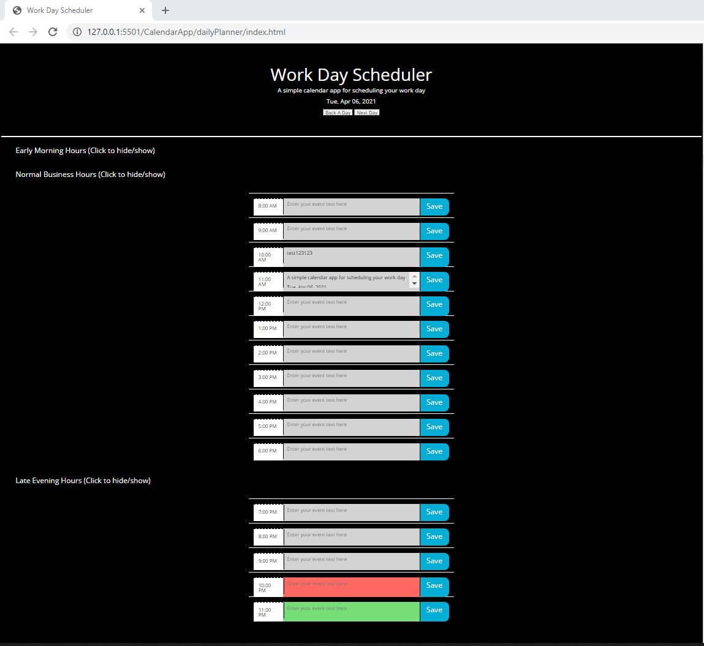

# dailyPlanner

JavaScript, jQuery, day.js HTML, Bootstrap app to track daily calendar events

GOAL: A simple JavScript program to dynamically add daily events to a calendar

DESCRIPTION: Build a basic applicationto show how javscript can be used to dynamically manipulate HTML.  
Here we have a simple daly calendar planner. When you first open the plaaner it will default to the current date and dispaly any evnts for the current date. We have three functioning sections for this planner, the normal business hours is te default that shows. We also allow for early morning hours and late evning hours. All three sections are accordian sections and can be shown/hidden by clicking on the section heading.

Each individual daily event description is saved by clicking the save button for that event. If nothing is entered in the events description for a row and the user clicks the corresponding save button , they will see an alert popup informing them they clicked save on an empty event description.

At the top of the app, under the display date are two additional buttons. These buttons are used to navigate to ther days in the planner. Clicking the Next Day button will advance the user to the next day and clicking the Back A Day button will navigate the user back a day. This will aloow the user to enter daily events on additional days of their choosing.

LINK: https://pmarceaujr.github.io/dailyPlanner/

SCREENSHOT:
